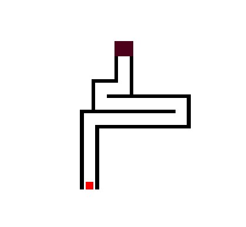
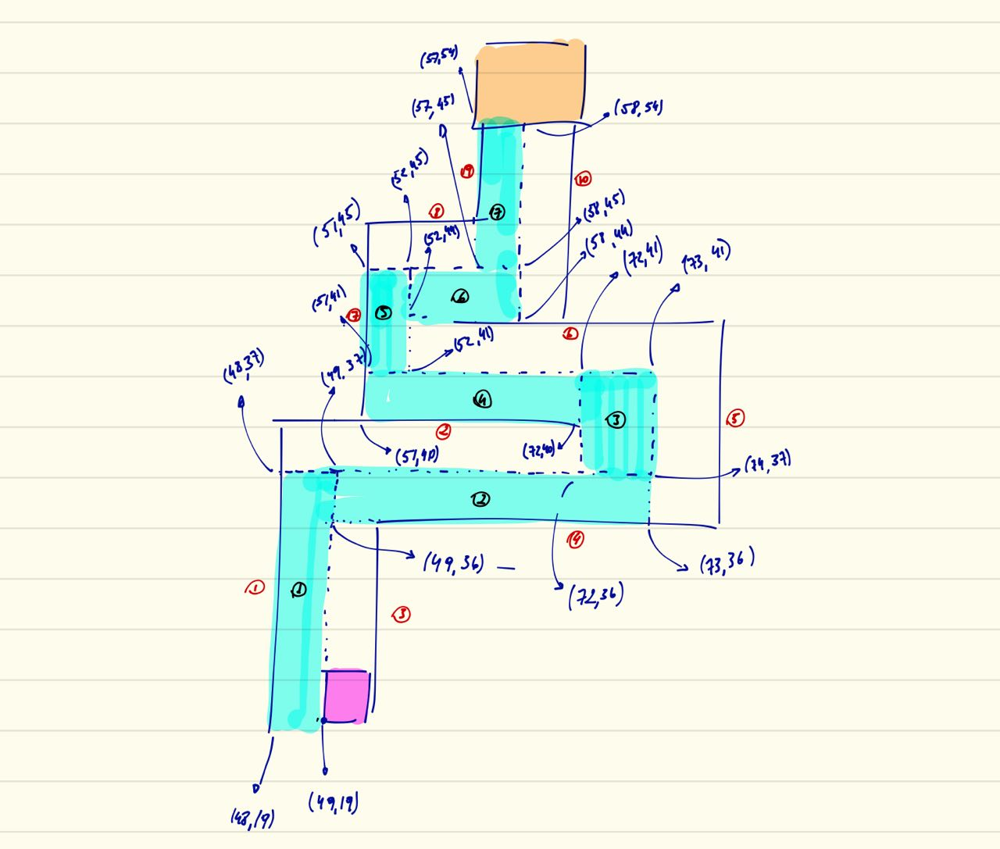

<head>
  <h1>Open_GL-Maze-Game</h1>
  
A game made using Open-GL
 
  
The square is moved trough the maze using the directional keys on keyboard. Do not touch the walls, if this happen, the square will be resumed to the initial position.

</head>
<body>
  <figure>
                                                                 <figcaption>&nbsp&nbsp;Fig 1. Final maze</figcaption> 
  </figure>                                                                                
  <figure>
    
    <figcaption>&emsp;Fig 2. Game mockup</figcaption>                                                                                  
  </figure>  
  
The reference to square position is the left down cornner. The blue area in the maze represents the limits for movimentation.

</body>                                                               
